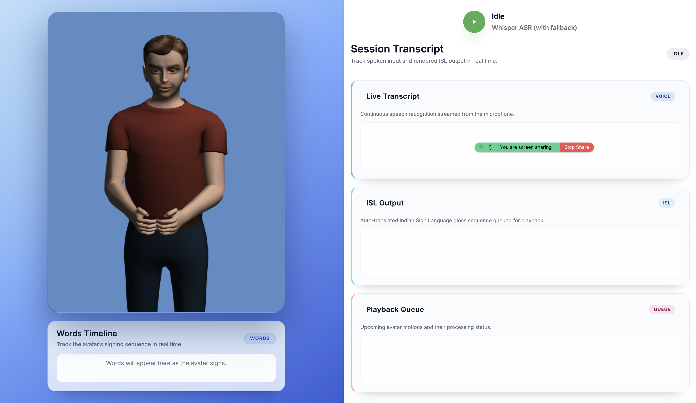
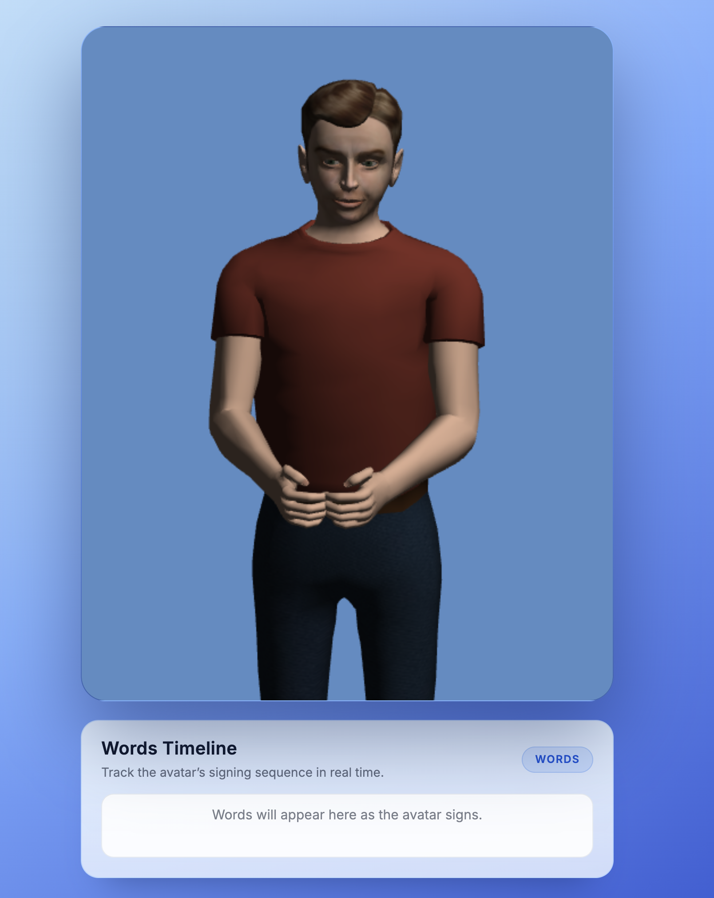

# Virtual Classroom with Indian Sign Language Support

Immersive classroom assistant that turns spoken lectures into synchronized Indian Sign Language (ISL) animations, complete with real-time transcripts, queueing, and feedback loops for continuous improvement.



---

## Overview

- **Real-time speech to sign**: Classroom audio is transcribed with Whisper ASR, translated into ISL glosses, and streamed into a 3D avatar.
- **Words Timeline & Session Transcript**: The UI tracks the avatar’s signing sequence word by word alongside live speech-to-text output.
- **Queue awareness**: Operators can inspect upcoming signs, processing status, and fallbacks directly in the dashboard.
- **Continuous learning**: Collected transcripts, annotations, and feedback feed the `ml_pipeline/` training loop for personalized translation models.

This project targets educators, researchers, and accessibility teams piloting ISL-first learning experiences.

---

## System Pipeline

```
Microphone / Screen Share Audio
          │
          ▼
services/asr_service.py  →  OpenAI Whisper (PyTorch)
          │  transcript + segments
          ▼
services/translation_service.py
    ├─ Seq2Seq LSTM translator (PyTorch)
    ├─ Stanford Parser fallback (Java via NLTK)
    └─ Token heuristics + lemmatization
          │  ISL gloss list
          ▼
services/isl_mapper.py  →  sigmlFiles.json lookup
          │  SiGML paths
          ▼
Browser UI (index.html + js/handler.js)
    ├─ Fetch SignFiles/*.sigml
    ├─ Reuse hamnosysData cached frames
    └─ Drive CWASA avatar (avatars/marc.jar)
```

For architecture diagrams, dashboards, and avatar details see `docs/` and `HOW_AVATAR_SIGNS_WORK.md`.

---

## Feature Highlights

- **Live Classroom Experience**
  - One-click microphone start/stop with animated listening states.
  - Words Timeline card displays the gloss currently being signed and what comes next.
  - Session Transcript panel streams voice-to-text output with ASR confidence markers.
  - Playback Queue exposes any items waiting on avatar rendering, making it easy to debug slow signs.

- **Fallbacks that keep class moving**
  - If the ML translator is unavailable, the Stanford Parser or token heuristics supply glosses.
  - Missing signs trigger automatic finger-spelling to keep visual output continuous.

- **Data & Feedback Workflow**
  - Annotation tool (`/annotation-tool`) captures corrections directly from instructors or interpreters.
  - Metrics endpoints (`/api/health`, `/api/system/health`) power the monitoring dashboards in `evaluation/`.

---

## Tech Stack

- **Runtime & Framework**
  - Python 3.9+, Flask REST services (`server.py`, `API/endpoints.py`)
  - `flask-cors`, `flask-limiter`, `psutil` for cross-browser API delivery and health probes
- **Speech Recognition**
  - `openai-whisper` (torch) with optional CUDA acceleration, FFmpeg preprocessing
  - Browser Web Speech API as a UX fallback when Whisper is not available on the host
- **Translation**
  - Seq2Seq LSTM implemented in `ml_pipeline/models/translator.py`
  - Stanford Parser (Java) via NLTK for deterministic grammar-based fallback
  - Vocabulary utilities in `ml_pipeline/utils/vocab.py`
- **Avatar & Rendering**
  - CWASA player (`avatars/marc.jar`, `avatars/marc/`) executing SiGML gestures
  - HamNoSys caches (`hamnosysData/`) and sign library (`SignFiles/`)
  - Frontend interaction handled by vanilla JS (`js/handler.js`) and Materialize-based UI (`css/custom.css`)
- **Tooling & Ops**
  - Docker & docker-compose for reproducible deployments; Kubernetes manifests in `k8s/`
  - Training helpers, dataset packaging, and Kaggle workflows under `scripts/` and `kaggle_notebooks/`

---

## Getting Started

### Prerequisites

- Python 3.9+
- FFmpeg (required by Whisper)
- Node/Java not required, but install **Java JDK 8+** for Stanford Parser fallback
- Optional: CUDA-capable GPU, Docker, docker-compose, kubectl, Kaggle CLI

### Local Setup

```bash
python3 -m venv venv
source venv/bin/activate            # Windows: venv\Scripts\activate
pip install --upgrade pip
pip install -r requirements.txt

# NLTK resources for lemmatization and fallback parser tagging
python -c "import nltk; nltk.download('averaged_perceptron_tagger_eng'); nltk.download('wordnet')"
```

### Run the Classroom UI

```bash
python server.py
# Open http://localhost:5001 in a modern browser
```

### Containerized Options

- Build: `docker build -t isl-classroom .`
- Dev compose: `docker-compose up`
- Production compose: `docker-compose -f docker-compose.prod.yml up -d`
- Kubernetes: `kubectl apply -f k8s/` (deployment, service, persistent volume claims)

Refer to `docs/DEPLOYMENT.md` for orchestration tips and production hardening.

---

## Walkthrough: Live Speech Session

1. Launch the server and open the UI at `http://localhost:5001`.
2. Click **Start Listening**. The microphone indicator turns green and Whisper begins streaming transcripts.
3. Observe the **Live Transcript** panel populate with ASR text in real time.
4. After translation, the **ISL Output** list updates with glosses queued for playback.
5. The 3D avatar signs each gloss. The **Words Timeline** highlights the gloss currently being animated and spells unmapped words letter-by-letter.
6. Use **Stop Share** to halt input; the system keeps the last timeline for quick review.



---

## API & Automation Examples

### Translate Text to ISL Glosses

```bash
curl -X POST http://localhost:5001/parser \
  -H "Content-Type: application/x-www-form-urlencoded" \
  -d "text=Please schedule the next class for tomorrow"
```

```json
{
  "isl_text_string": "please schedule next class tomorrow",
  "pre_process_string": "please schedule next class tomorrow",
  "original_english": "Please schedule the next class for tomorrow"
}
```

### Submit Feedback for Model Retraining

```bash
curl -X POST http://localhost:5001/api/feedback \
  -H "Content-Type: application/json" \
  -d '{
        "translation_pair_id": 42,
        "feedback_type": "user_correction",
        "is_correct": false,
        "corrected_text": "student learn future class",
        "comments": "Use FUTURE marker"
      }'
```

Corrections are stored in `data/training_data.db` and surfaced in the annotation tool for dataset curation.

---

## Data, Models, and Training

- **Sign Library**: `SignFiles/` (800+ SiGML gestures) plus HamNoSys caches for instant playback.
- **ML Assets**: `models/lstm_translator.pth`, `models/vocab_src.json`, `models/vocab_tgt.json`.
- **Dataset management**: JSON splits in `data/`, SQLite training DB, and Kaggle packaging scripts.
- **Training**: Use `scripts/train_translation_model.py` locally or run `kaggle_notebooks/train_isl_model_complete.py` on a GPU kernel; align vocabularies before deploying new weights.

See `docs/TRAINING.md` and `docs/DATA_COLLECTION.md` for detailed guidance.

---

## Troubleshooting

- **Whisper fails to load**: confirm FFmpeg is installed and the device has sufficient memory; logs surface via `services/asr_service.py`.
- **No ISL output**: verify `models/lstm_translator.pth` and vocab files exist; if absent, start with rule-based fallback (Stanford Parser requires Java).
- **Missing sign asset**: check for the corresponding `.sigml` in `SignFiles/`; add new gestures and update `js/sigmlFiles.json`.
- **Avatar not rendering**: ensure Java is allowed in the browser or run the app in a CWASA-compatible environment (see `HOW_AVATAR_SIGNS_WORK.md` for manual setup).
- **Health checks**: query `/api/system/health` and `/api/health` for service status, CPU/memory metrics, and fallback indicators.

---

## Project Structure (abridged)

- `server.py`, `API/` – Flask entrypoints and middleware
- `services/` – ASR, translation, ISL mapping
- `js/`, `css/`, `index.html` – Frontend dashboard and avatar controller
- `ml_pipeline/`, `scripts/` – Data ingest, model training, evaluation utilities
- `evaluation/` – Monitoring dashboards
- `docs/` – Deployment, API, data collection, and training guides

---

